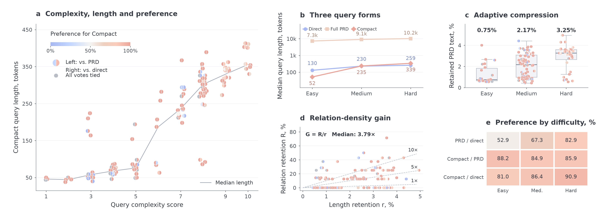
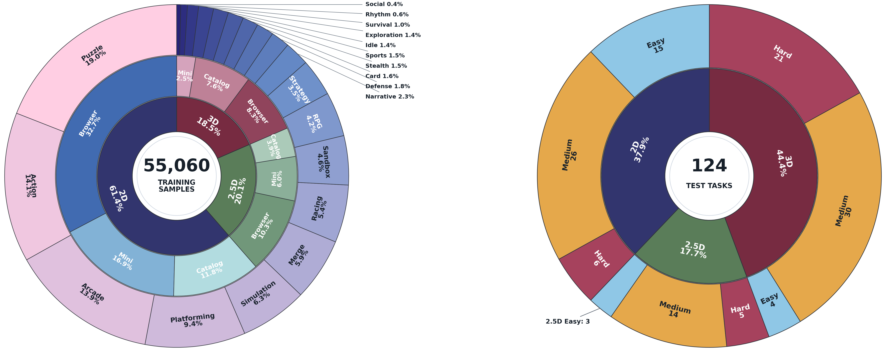
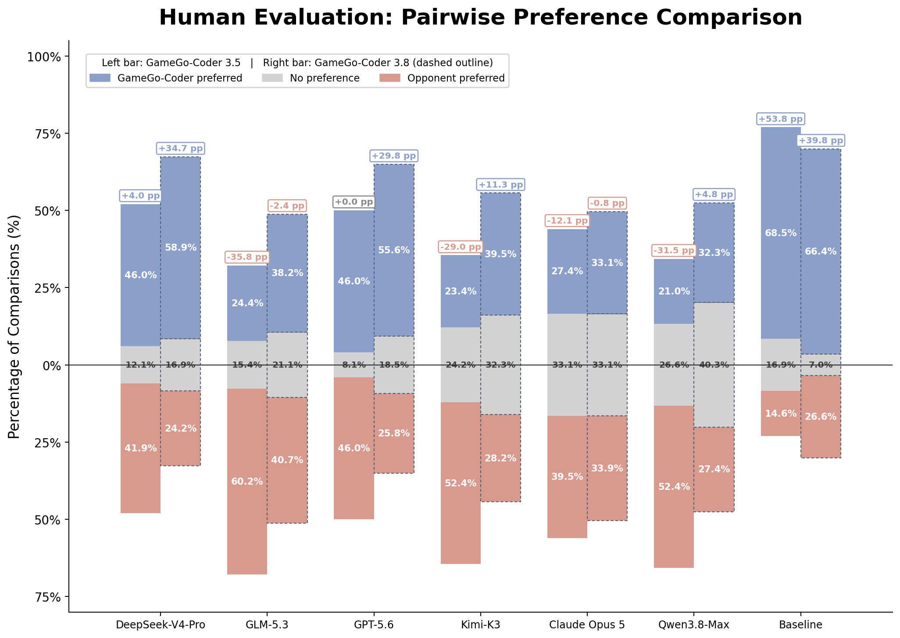
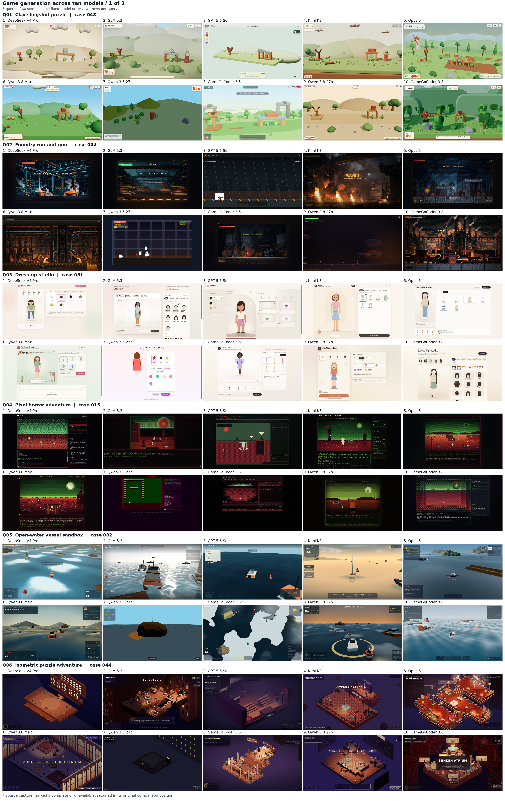
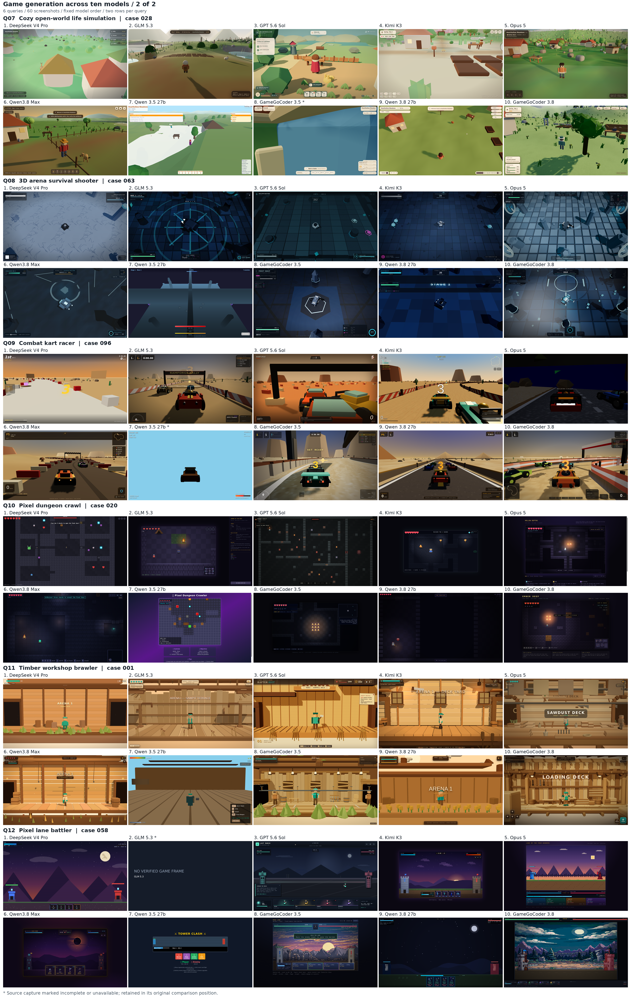

<div align="center">

# GameGo: Training Game-Dev Agents with Synthetic Trajectories Anchored in Real-World Assets

[](https://huggingface.co/Y36521478Y/GameGoCoder3_5)
[](https://huggingface.co/Y36521478Y/GameGoCoder3_8)
[](https://huggingface.co/datasets/Y36521478Y/GameGo)

**GameGo** is a data-centric framework for training coding agents to create playable browser games. It turns real-world game seeds into structured development specifications, selects a compact task-specific interface for rollout, and collects executable development trajectories as process supervision.

</div>

<p align="center">
  <a href="https://haoyue-yang.github.io/GameGo/"><strong>🎮 PLAY THE GAMES ONLINE →</strong></a>
</p>


## Playable GameGoCoder 3.8 examples

[Play online](https://haoyue-yang.github.io/GameGo/) · [Open the 12-game playable gallery in the repository](./games/) to try the successful games from the selected 13-task evaluation set. Each card includes the built browser game, a preview image, and the original artifact tar package.

The gallery covers the appendix showcase tasks across 2D, 2.5D, and 3D settings. The failed selected-set entry is excluded.

<p align="center">
  
</p>

## Overview

Game creation is a long-horizon software task: an agent must coordinate gameplay rules, state transitions, controls, spatial interaction, assets, visual presentation, and runtime verification in one executable artifact. Short user requests leave these dependencies implicit, while exhaustive specifications can burden the rollout agent with unnecessary commitments.

GameGo uses an **expand-then-project** pipeline:

```text
real-world game seed
        │
        ▼
structured planning and asset grounding
        │
        ▼
full Product Requirements Document (PRD)
        │
        ▼
task-adaptive compact query
        │
        ▼
teacher-agent rollout in a sandbox
        │
        ▼
validated trajectory + runnable game artifact
        │
        ▼
GameGoCoder supervised fine-tuning
```

The PRD is a coverage-oriented internal representation. The compact query preserves task identity, executable dependencies, controls, spatial contracts, and success or recovery paths while leaving routine implementation choices open to the coding agent.

## Highlights

- **Real-world grounded task synthesis.** Game seeds are collected from public game catalogs and normalized before planning.
- **Three-dimensional coverage.** GameGoData spans 2D, 2.5D, and 3D browser games across 20 gameplay categories.
- **Process-grounded supervision.** Each retained example contains a development trajectory paired with a verified runnable artifact.
- **Adaptive task interfaces.** Query detail grows with task complexity instead of applying one fixed prompt length.
- **End-to-end evaluation.** GameGoCoder is evaluated on ArtifactsBench-G, CookieBench-G, and the held-out GameGoBench.

## GameGoData

GameGoData contains **55,060** filtered development trajectories. The data pipeline records teacher-agent messages, tool calls, tool responses, and the final project, then keeps examples that pass execution, artifact-integrity, and formatting checks.

<p align="center">
  
</p>

| Split | Count | Description |
| --- | ---: | --- |
| GameGoData | 55,060 | Training trajectories with runnable browser-game artifacts |
| GameGoBench | 124 | Held-out game-development tasks for evaluation |

GameGoData composition is **61.4% 2D**, **20.1% 2.5D**, and **18.5% 3D**. GameGoBench contains **47 2D**, **22 2.5D**, and **55 3D** tasks, stratified into Easy, Medium, and Hard difficulty levels.

## GameGoBench

GameGoBench evaluates game-development agents under a shared browser-game scaffold and sandbox budget. Evaluation considers execution success, task-requirement satisfaction, and visual and interaction quality. Benchmark seeds are kept separate from the training seed pool from the task-construction stage onward.

## Results

GameGoCoder is trained with standard supervised fine-tuning on GameGoData. On the held-out GameGoBench, it improves over its matched base models:

| Model | Execution | Requirements | Quality | Overall |
| --- | ---: | ---: | ---: | ---: |
| Qwen3.5-27B | 91.80 | 36.89 | 31.12 | 34.00 |
| **GameGoCoder 3.5** | **98.29** | **57.99** | **45.72** | **51.85** |
| Qwen3.8-27B | 100.00 | 62.81 | 42.25 | 52.53 |
| **GameGoCoder 3.8** | **100.00** | **66.94** | **43.64** | **55.29** |

Task-specific compact queries are preferred over full PRDs in **85.7%** of non-tied human judgments and over direct queries in **86.6%**. They achieve a median **3.79× relation-density gain** with complexity-adaptive query lengths.

<p align="center">
  
</p>

## Qualitative examples

Representative generated games across 2D, 2.5D, and 3D settings are shown below.

<p align="center">
  
</p>

<p align="center">
  
</p>

The full pipeline overview is available as [the main figure PDF](./figure/mainpic.pdf).

## Repository contents

This repository is the lightweight project page for GameGo:

```text
.
├── README.md
├── index.html
├── games/
│   ├── index.html
│   ├── manifest.json
│   └── 12 playable GameGoCoder 3.8 examples
└── figure/
    ├── mainpic.pdf
    ├── T_soft_palette_overview_v2.png
    ├── train_test_spaced.png
    ├── pairwise_result_v2.png
    ├── figure_1_6games.png
    └── figure_2_6games.png
```

Training code, datasets, and model checkpoints will be linked here when their public release packages are available.

## Citation

```bibtex
@inproceedings{gamego2027,
  title     = {GameGo: Training Game-Dev Agents with Synthetic Trajectories Anchored in Real-World Assets},
  author    = {GameGo Authors},
  booktitle = {International Conference on Learning Representations},
  year      = {2027}
}
```

## License

The license for the released figures and accompanying materials is **TBD**.
